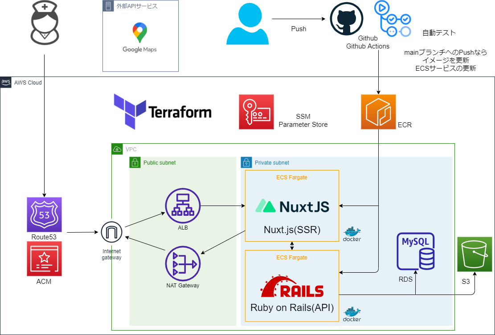
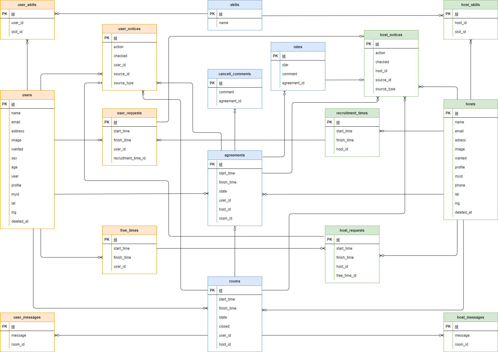
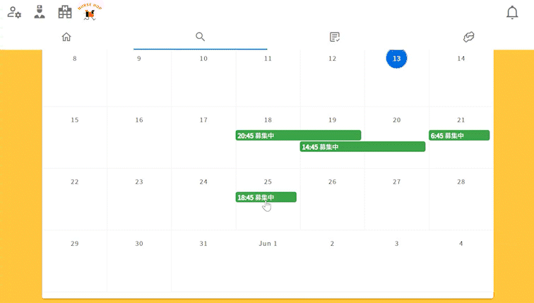
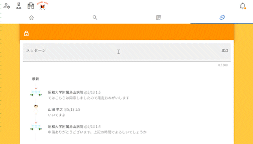
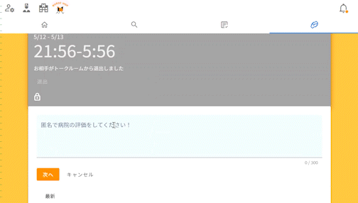

# ポートフォリオ紹介
ポートフォリオ`nurse hop`は、看護師側、病院等側にユーザーを分けた単発バイトマッチングアプリです。  
https://nurse-hop.com

## 使用技術

 

`【バックエンド]`

- Ruby 2.7.1

- Rails(API) 6.0.4.1

RailsはAPIモードで作成し、フロントとは完全分離しています

`【フロントエンド】`

- Nuxt.js(SSR) 2.15

- Vuetify 1.12.1

NuxtはSSRモードで作成し、SPAにしています。  
Vuexを使用してステート管理をしています。

`【テスト】`

- Rspec

- Jest(コンポーネントテストを少し)

`【インフラ】`

- AWS(ACM, RDS(MySQL 5.7), ECR,ECS(Fargate), S3, Route53, SSM)

- GithubActions (CI, CD)

- Docker 20.20.5

- Docker-compose 1.29.0

- Terraform 0.15.5

 

CI、CDはGithub Actionsを使用しデプロイまでに必要な作業をGitHub上で完結させています。  
ローカル環境から本番環境までdockerを使用しています。  
本番環境の環境変数はSSMで管理しています

 

 

通知機能はポリモーフィック関連で作成しています

 

 

## 機能紹介

 

※看護師からみた病院、病院からみた看護師を【お相手】と呼んでいます。  
※利用者からお相手に送ったリクエストを【リクエスト】、届いたリクエストを【オファー】と呼んでいます。

 

サービス選定の背景

現在看護師として働いていない潜在看護師と言われる人の人数は70万人と、全体の看護師の3分の1を占めています。  今日のコロナ渦の影響や、今後さらに加速する高齢化社会において潜在看護師の活躍が求められています。  
潜在看護師の復職しない理由において

1. 夜勤ができない
2. 職場の受け入れ環境が不安
3. 現在の医療技術についていけない
4. 責任が重く、医療事故が怖い
5. 急な休みが取れない

等の理由が上位である現状があります。
これらの理由をカバーして潜在看護師が働きやすくなるアプリを作成してみたいと考えました。  

 

類似サービスとの差別化

病院等側からも看護師側にバイトのオファーができるようにして病院側が積極的に人手不足を解消できるようにしました。  
契約の前に看護師-病院等間でメッセージをやり取りしコミュニケーションを図ることで、事前に詳しい業務内容確認できたりなど、不安を解消できるようにしました。  
業務形態を単発バイトに絞ることでターゲットの選定を明白にしました。  
看護師側は苦手なスキル、病院側は必須スキルを登録することで、医療技術でついていけないという不安を解消できるようにしました。

 

サービスの一連の流れを紹介

 
  ※デザインは現在と異なっている場合があります！
 

 

1. 募集時間を登録します。

 

 

2. 気になるお相手がいたらリクエストを送ります。

 

 

3. オファーからトークルームを作ります。またはお相手が作ってくれるかもしれません。

 

 

4. 話し合いの元最終的な時間を決定し契約を確定します。

 

 

5. 勤務終了後、匿名でレビューを作成できます。

 

 

 

`【共通機能】`

- 認証系(新規登録、ログイン、ログアウト、退会（論理削除）、プロフィール各種変更、アバター画像登録、ゲストログイン)

- スキル機能(看護師側は苦手なスキル、病院側は必須スキルを登録することで絞り込み)

- 募集時間(お相手がリクエストを遅れる時間帯)作成、削除

- リクエスト作成、削除

- オファー削除

- トークルーム作成、キャンセル

- 契約作成(トークルームから最終的な日時を決定し契約を確定)

- 時間経過により無効になった登録時間やオファー等自動削除、状態変更

- カレンダー

- 病院レビュー条件ソート

- 通知（アプリ内）

- 利用履歴確認

- お相手の履歴確認

- 無限スクロール

- google map apiでお相手住所表示

`【看護師側機能】`

- 契約キャンセル

- 急なキャンセル(開始48時間以内)の場合に理由を作成

- 匿名での病院レビュー

- 病院一覧

- 病院条件ソート、検索

- google map apiでルート表示

`【病院側機能】`

- 看護師一覧

- 看護師条件検索